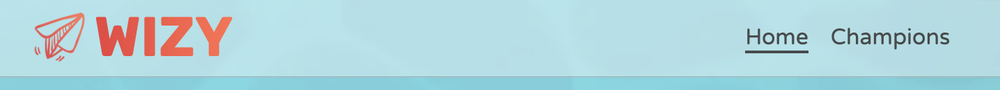

# HEPY Website

## Index – Table of Contents

- [Purpose](#purpose)
- [UX Design](#ux-design)
- [Features](#features)
- [Design](#design)
- [Technologies](#technologies)
- [Testing](#testing)
- [Deployment](#deployment)
- [Credits](#credits)
- [Acknowledgments](#acknowledgments)

# Purpose

Our goals:

The website is built using HTML, CSS and Javascript as a Portfolio Project#2 for the Code Institute's Full Stack Developer(e-Commerce) course.

[The live WIZY website](https://tayapro.github.io/wizy/)

---

# UX Design

## User stories

### As a **first time user**

- I want to easily understand the primary objective of the website.

### As a **returning** and a **frequent user**

- I want to easily navigate the website.
- I want to make sure I don't get lost on this website.

# Features

## Existing Features

### F01 Navigation Bar

Each page has a sticky navigation bar at the top that is fully responsive. It includes a logo linking to the Home page, as well as links to the Home, Champions pages. The navigation bar layout is consistent across all devices, making navigation simple and intuitive. The underline appears when you move the mouse over the menu links.

For mobile devices, it transforms into a compact "hamburger menu." This dropdown menu contains the same items, displayed in a column on a semitransparent background.

### F02 Home page - image and call to action

### F03 Home page - tagline

### F04 Home page - testimonials

### F05 Home page - HEPY team message

### F06 Footer

### F07 Lifehacks page

### F08 Subscribe page

### F09 page 404

## Future features

> -

# Design

## Imagery

## Colour Scheme

## Typography

For this project Rubik (logo) and Varela Round (body text) are used as fonts.  
Rubik font is great for a game app logo because its bold, modern design makes it stand out. 
Varela Round, with its friendly and rounded design, offers excellent readability and a warm,
approachable feel, making it a great choice for game apps.

## Wireframes

### Main Page Wireframes

### Rules Wireframes

### Game Wireframes

### Outcome Wireframes

### 404 page Wireframes

### 500 page Wireframes

# Technologies

## Languages

- HTML5
- CSS
- Javascript

## Frameworks, Libraries & Apps

| Name                                                      | Purpose                                                 |
| :-------------------------------------------------------- | :------------------------------------------------------ |
| Google Fonts                                              | Fonts                                                   |
| Font Awesome                                              | Icons                                                   |
| Favicon.cc                                                | Create website favicon                                  |
| [Photopea](https://www.photopea.com/)                     | Work with images (resize, convert, etc)                 |
| [GoDaddy](https://www.godaddy.com/)                       | Generate HEPY logo                                      |
| [Pixelcut](https://create.pixelcut.ai/background-remover) | Remove image's background                               |
| [Vmake.ai](https://vmake.ai/image-outpainting)            | Expand the image                                        |
| [Imagecolorpicker](https://imagecolorpicker.com)          | Color picker                                            |
| Balsamiq                                                  | Build interface website wireframes                      |
| Git                                                       | Use for version control                                 |
| GitHub                                                    | Store the source code and deploy and host the live site |
| GitPod                                                    | Set up and run project code                             |
| Google Chrome's Dev Tools                                 | Inspect elements, layouts, debug pages                  |
| Google Chrome's Lighthouse                                | Check the performance, quality, and correctness of site |
| Google Chrome's Screen Reader                             | Test screen-reader accessibility                        |
| W3C HTML Markup Validator                                 | Validate HTML code                                      |
| W3C Jigsaw CSS Validator                                  | Validate CSS code                                       |
| JSHINT                                                    | Validate JS code                                        |

# Testing

## Features testing

[Test results]() as Google sheets.

Responsive layout has been check for all screen sizes, and focused on most popular, based on [screen-resolution-stats](https://gs.statcounter.com/screen-resolution-stats/all/worldwide/2023).

## User stories testing

This section shows connection between [Features](#features) and [UX design](#ux-design) sections.

### As a first time user

### As a returning/frequent user

- I want to easily navigate the website.

  > The user can locate the necessary pages by using the links in the navigation bar. \
  > For more details, see [F01 Navigation bar](#f01-navigation-bar)

- I want to feel welcomed on WIZY website.

- I want to make sure I don't get lost on this website.

  > In case of the user find themself on 404 page, they easily to find a link to HEPY home page. \
  > For more details, see [#F09 page 404](#f09-page-404).

## Validator testing

### HTML Validator

The W3C Markup Validation Service was employed to check the HTML of the website.  
All pages passed without any errors or warnings.

Home

Rules

Game

Outcome

Champions

404 page

### CSS Validator

The W3C Jigsaw CSS Validation Service was employed to check the HTML of the website.  
The CSS page passed without any errors or warnings.

CSS

### JS Validator

The JSHint Validation Service was employed to check the JS files.  
The JS files passed without any errors.

js/components/alphabet.js

js/components/champions.js

js/components/complexity.js

js/components/life.js

js/components/outcome.js

js/components/score.js

js/components/user.js

js/components/word.js

js/lib/animate.js

js/pages/champions-page.js

js/pages/game-page.js

js/pages/landing-page.js

js/pages/outcome-page.js

js/pages/rules-page.js

js/main.js

## Performance

Google Lighthouse in Google Chrome Developer Tools was used to check the website performance.

### Home

Home desktop

Home mobile

### Rules

Rules desktop

Rules mobile

### Game

Game desktop

Game mobile

### Outcome

Outcome desktop

Outcome mobile

### Champions

Champions desktop

Champions mobile

### 404 page

404 page desktop

404 page mobile

### 500 page

500 page desktop

500 page mobile

## Device/Browser Compatibility

Testing has been carried out on the following devices:

1. Macbook Sanoma Version 14.4.1:

   - Chrome Version 124.0.6367.61 (Official Build) (arm64)
   - Firefox Version 126.0.1 (64-bit)
   - Safari

2. Samsung S20:

   - Chrome Version 125.0.6422.165
   - Samsung Internet Version 25.0.1.3

3. iPad Air 5th generation:

   - Safari
   - Chrome

4. Windows PC:
   - Chrome Version 124.0.6367.61 (Official Build) (arm64)

# Deployment

## How to fork and deploy

1. Fork GitHub [WIZY repository](https://github.com/tayapro/wizy).
2. In the GitHub repository, navigate to the **Settings** tab and select **Pages** from the left-hand menu.
3. In the source section drop-down menu, choose the **Main Branch** and click button **Save**.
4. Once the **Save** is clicked, the page will automatically refresh and display a detailed ribbon to indicate successful deployment.
5. Any changes pushed to the main branch will be reflected in the live project.

## How to clone

1. Visit the [WIZY repository](https://github.com/tayapro/wizy) on GitHub.
2. Click the **Code** button on the right side of the screen, select **HTTPs**, and copy the provided link.
3. Open a terminal and navigate to the directory where you want to clone the repository.
4. On the command line, type `git clone`, paste the copied URL, and press the **Enter** key to begin the process.

# Credits

## Content

- The hamburger menu for mobile devices and footer icons as ideas were taken from "Love running" lesson.
- All other content was written by the developer.

## Media

## Code

## Media

- The fonts used were imported from [Google Fonts](https://fonts.google.com/)
- The icons in the header, footer were taken from [Font Awesome](https://fontawesome.com/icons)

# Acknowledgments

I want to give a big thanks to my mentor, Ronan McClelland. He gave me awesome advice on how to plan and do this project.  
Plus, he showed me useful stuff for coding and testing.  
Thanks to the Slack Community for always being there to answer my questions, sometimes even before I asked them!
