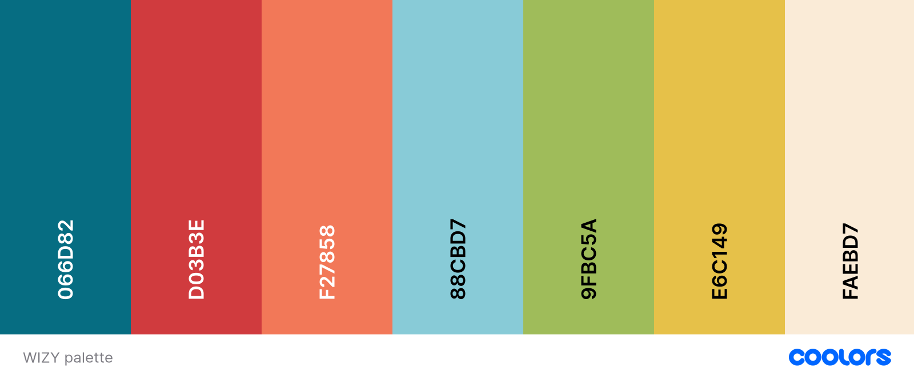
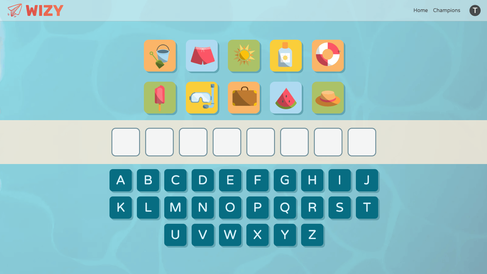
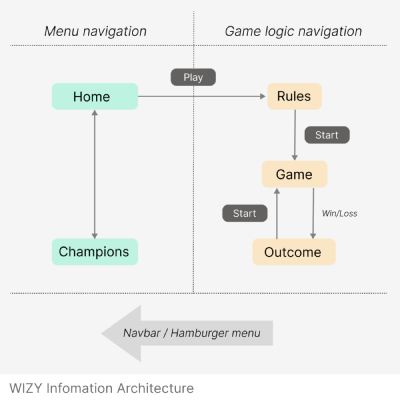
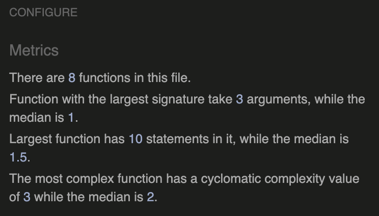
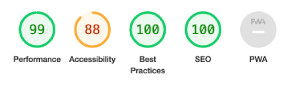

# WIZY web application


## Table of Contents

- [Introduction](#introduction)
- [UX design](#ux-design)
  - [User Stories](#user-stories)
  - [Wireframes](#wireframes)
  - [Key Design Decisions](#key-design-decisions)
    - [Imagery](#imagery)
    - [Color Scheme](#colour-scheme)
    - [Typography](#typography)
    - [Interactive Elements](#interactive-elements)
- [Features](#features)
  - [Existing Features](#existing-features)
  - [Future Features](#future-features)
- [Project UI Structure and Infomation Architecture](#project-ui-structure-and-infomation-architecture)
- [Project Architecture](#project-architecture)
  - [Architecture](#architecture)
  - [Code Structure](#code-structure)
  - [Game Logic](#game-logic)
  - [Score Calculation](#score-calculation)
  - [Libraries and Tools](#libraries-and-tools)
- [Technologies](#technologies)
- [Testing](#testing)
  - [Features testing](#features-testing)
  - [User stories testing](#user-stories-testing)
  - [Validator testing](#validator-testing)
  - [Performance](#performance)
  - [Device/Browser Compatibility](#devicebrowser-compatibility)
- [Deployment](#deployment)
  - [How to fork and deploy](#how-to-fork-and-deploy)
  - [How to clone](#how-to-clone)
- [Credits](#credits)
  - [Content](#content)
  - [Media](#media)
  - [Code](#code)
- [Acknowledgments](#acknowledgments)

# Introduction

Who wouldn't want to be on a sandy beach by the ocean when it's raining in Ireland in the middle of July?

The WIZY hangman web application is a classic word-guessing game with a sunny vacation theme. Guess a word, save as many lives as possible, and discover your destination. It could be a stroll in the nearest park, a quick weekend trip to see your grandma, or a long vacation on a beach by the ocean.

In this game, lives are represented by travel essentials such as sunglasses, a suitcase, a hat, a camera, etc. The words to guess are based on common themes and vary in difficulty levels.

The goals are to create a challenging and enjoyable experience with different difficulty levels, easy-to-use controls, and attractive animations. The main objective is to make learning new words fun and entertaining.

The WIZY web app is built using HTML, CSS and Javascript as a Portfolio Project#2 for the Code Institute's Full Stack Developer(e-Commerce) course.

[The live WIZY web application](https://tayapro.github.io/wizy/)

---

# UX Design

The WIZY Hangman Game aims to provide an engaging and enjoyable user experience. The design focuses on simplicity, clarity, and fun to keep users entertained and motivated.

## User Stories

As a **user**,

- I want to easily understand the primary objective of the website.
- I want to see something personal, like my name or initials.
- I want to view a tutorial or instructions, so that I understand how to play the game.
- I want to select the difficulty level of the game, so that I can choose how challenging the game will be.
- I want to see animations when I guess a letter correctly or incorrectly, so that the game feels more interactive and engaging.
- I want to see a win or lose animation, images, message at the end of the game, so that I know the outcome.
- I want to view a leaderboard of top scores, so that I can compare my performance with others.
- I want to easily navigate the website.
- I want to make sure I don't get lost on this website.

## Wireframes

### Main Page Wireframes


### Rules Wireframes


### Game Wireframes


### Outcome Wireframes


### Champions Wireframes


### 404 page Wireframes


### 500 page Wireframes


## Key Design Decisions

### Imagery

The WIZY application includes fun cartoon characters, like a pineapple floating on an inflatable ring or a slice of watermelon lounging by the pool. It also features vibrant flat design vector images with a vacation theme, such as sunglasses, beach balls, and surfboards. All pages have a consistent background that resembles a swimming pool, creating a cohesive and inviting visual experience. This playful design theme aims to put users in a cheerful mood and enhance the overall gaming experience.

### Colour Scheme

The WIZY application's color palette is thoughtfully crafted to evoke feelings of warmth, fun.<br >
It’s designed to evoke a sense of relaxation and joy, whether users are solving a puzzle or exploring the app.
<br ><br >

<br ><br >

-  #066D82 - **Carribean current** <br >
  A deep, vibrant teal, reminiscent of tropical waters. This color provides a refreshing and calming backdrop, evoking the serenity of a beach vacation.

-  #D03B3E - **Poppy** <br >
  A bold and striking red that brings energy and excitement. This vibrant hue captures attention and adds a lively touch, perfect for highlighting important elements.

-  #F27858 - **Burned sienna** <br >
  A warm, earthy orange that adds a rustic charm. This color is akin to a beautiful sunset or autumn leaves, providing a cozy and inviting feel.

-  #88CBD7 - **Non photo blue** <br >
  A light, airy blue reminiscent of clear skies. This uplifting color adds a breezy, cheerful touch, promoting a sense of clarity and openness.

-  #9FBC5A - **Olivine** <br >
  A soothing, natural green that brings a hint of nature. This color is similar to fresh foliage, offering a grounding and balancing effect.

-  #E6C149 - **Saffron** <br >
  A rich, golden yellow that exudes warmth and positivity. This cheerful hue is reminiscent of sunflowers, adding a sunny and optimistic vibe to the palette.

-  #FAEBD7 - **Antique white** <br >
  A soft, creamy off-white that serves as a neutral backdrop. This elegant color provides a timeless quality, helping to tie the other colors together harmoniously.

To ensure clear visibility and readability, the following contrast colors have been chosen for the WIZY application:

-  #3B3B3B - **Onyx**:
  A dark gray color that shows up well against lighter backgrounds. It's used for text and important elements so they're easy to read.

- #FFFFFF - **White**
  A bright white color that stands out against darker and more colorful backgrounds. It's great for text and icons, making them clear and easy to see.

These contrast colors help make sure everything on the app is easy to read and use.

### Typography

For this project Rubik (logo) and Varela Round (body text) are used as fonts. <br>
Rubik font is great for a game app logo because its bold, modern design makes it stand out.<br>
Varela Round, with its friendly and rounded design, offers excellent readability and a warm,
approachable feel, making it a great choice for game apps.

### Interactive Elements

Animations were added to the stars and life icons to make the WIZY game more dynamic and engaging. The animations are subtle yet effective in providing feedback to the user.

# Features

## Existing Features

### F01 Navigation Bar

Each page has a sticky navigation bar at the top that is fully responsive. It includes a logo linking to the Home page, as well as links to the Home, Champions pages. The navigation bar layout is consistent across all devices, making navigation simple and intuitive. The underline appears when you move the mouse over the menu links.


For mobile devices, it transforms into a compact "hamburger menu." This dropdown menu contains the same items, displayed in a column on a semitransparent background.


### F02 Home page - image and call to action

When you visit the WIZY website, you're greeted by a cheerful cartoon pineapple floating on an inflatable ring in a pool or the sea. His big sunglasses and laid-back pose show he's really having a great time on his vacation. This instantly sets a positive tone.

The playful pineapple, catchy tagline, and game invitation convey the website's overall fun and engaging theme.

<p float="left">
  
   
</p>

A fun and inviting call to action with an input field for user's name and a "Play" button makes starting the WIZY game exciting and easy.

> [!NOTE]
> The picture cropping on small screens is intentional and reflects the author's personal style.

### F03 Home page - initial state

Initially, the local store will only contain an actual list of champions.
When the user goes to the home page of the application to change their name, their champion achievements will be saved.
However, any existing records with the keys `Username`, `Complexity`, and `Outcome` will be deleted.

### F04 Home page - input form

A friendly input field with the placeholder "Enter your name" and a "Play" button offers a straightforward and complete way for users to log in and start playing.

  

The LocalStorage will store a `Username` record as a key and the entered name as a value.

   

### F05 Rules page

Every game needs rules! The WIZY rules page offers them with the icons and brief instructions. Here, users can choose a game level, from easy ("Picnic in the Park") to hard ("Sunny Beach"). <br > The theme and level names match the main page, keeping the vacation vibe going.

The Rules page's design has two versions, one for mobile devices and another for laptops.

<p float="left">
  
   
</p>

### F06 Rules page - select form

The Rules page includes a user-friendly form where players can choose the game's difficulty level from a dropdown menu.


The LocalStorage will store a `Complexity` record as a key and LEVEL number as value.


Complexity levels mapping:

| Complexity's name    | number in WIZY system |
| :------------------- | :-------------------- |
| _Picnic in the Park_ | 0                     |
| _Campfire Tales_     | 1                     |
| _Sunny Beach_        | 2                     |

### F07 Rules page - user's icon

In the top right corner of the header, users can see their name's first letter displayed as an icon (this applies to all screen sizes).

<p float="left">
  
   
</p>

The user's name is stored in localStorage, as explained in the _F03 Home page - input form_ section above. <br >
This information is used by a JavaScript function to read and update the DOM element on the Rules page.

### F08 Game page

And finally, let's talk about the main page of the game itself. The design matches the overall style of the app. <br >
The screen is logically divided into three sections:

- The first section shows life blocks with colorful pictures of vacation items. These blocks animate when a life is lost.
- The second section has empty blocks for the hidden word, which reveal a letter when a correct guess is made.
- The third section contains the letters of the English alphabet.

<p float="left">
  
   
</p>

In the top right corner of the header, users can see their name's first letter displayed as an icon (this applies to all screen sizes).

On the Game page, the user's `Username` and `Complexity` records in localStorage are preset based on previous steps.
The chosen word is randomly selected according to the complexity level.

### F09 Game page - lives blocks

The vacation-themed images blend seamlessly with the WIZY app's design, adding simplicity and vibrant colors.
When a player fails to guess a letter during the game, a random card is flipped over with an animation.

Animation for live blocks is randomly chosen for each game. There are 3 types of animation:

- Flip
- Swipe
- Swirle

Short video with lives blocks animation:


> [!NOTE]
> During the process of video file compression to GIF format by **Ezgif** app,
> the animation seems a little jerky. Link to [original video](./assets/images/readme/f09_live_blocks.mov).

### F10 Game page - alphabet buttons

Alright, so everything is working smoothly with the live blocks animations, but what about the letter buttons? <br >

With them, it's a bit simpler - when each button is pressed, it undergoes a small transformation.
After that, the button becomes inactive, the color of the letter changes to a more muted shade, and pressing it is then blocked.

Short GIF video how alphabet buttons work:


> [!NOTE]
> During the process of video file compression to GIF format by **Ezgif** app,
> the transformation is not visible when the some buttons are pressed. Link to [original video](./assets/images/readme/f10_alphabet_buttons.mov).

### F11 Outcome page

Regardless of the game's result, players always want to see their outcome.
In the WIZY game, the outcome page provides a visual representation based on the stars earned.<br >
If the player wins, they see their points and, if they’re in the top five, a link to the champion's scoreboard with their ranking.

- For one star:

  - One gold star after animation
  - The image (adapted to different screen sizes):
      <p float="left">
         
         
      </p>
  - "Grab your bike and go to a park" message

- For two stars:

  - Two gold stars after animation
  - The image (adapted to different screen sizes):
      <p float="left">
         
         
      </p>
  - "Pack your backpack and visit your granny" message

- For three stars:

  - Three gold stars after animation
  - The image (adapted to different screen sizes):
      <p float="left">
         
          
      </p>
  - "Sounds like someone is going to Hawai" message

If luck isn't on player's side and they lose, the Outcome page offers encouraging messages alongside a humorous picture of a girl in heart-shaped glasses.

<p float="left">
   
    
</p>

The score, tier, win/loss, and time data for the Outcome page are stored in a localStorage record called `Outcome`.

After every game, a player is encouraged to start a new game by selecting the difficulty level and keeping the same name.

> [!NOTE]
> If the user wants to start a new game with a different name, they should go to the main page and enter the new name.

### F12 Outcome page - aminated stars

<table style="border:none;">
   <tr>
      <td width="220px">
         
      </td>
      <td>
         Winners of the game will enjoy a delightful star animation as a small reward.
         The outcome of the game decides how many stars turn from gray to gold during the animation, <br >
         starting from the left star and moving to the right.<br >
         In the event of the user's loss, the animation will not occur, and the stars will retain their gray color.
      </td>
   </tr>
</table>

### F13 Outcome page - select form

Using the form, a user can easily change the difficulty level for a new game, just like on the rules page, see **F06 Rules page - select form** section above.


The LocalStorage will store a new `Complexity` record as a key and LEVEL number as value, overwriting the existing complexity LEVEL number.

### F14 Champions page

The champions page has a clean card design, with a stars image and a list of champions ranked from first to fifth place.
The design of Champions page is consistent across all devices.

<p float="left">
   
    
</p>

The data for this page is loaded from the local store and contains value of the `Champions` record.

### F15 Champions page - initial champion's list

When you first visit the site or after clearing the cache, the site loads an initial list of champions from localStorage,
to provide content to the Champions page.

During the initial site visit, champions are loaded from localStorage to provide content to the Champions page.

The initial `Champions` record:

```
Champions: [
{name: "Alice", score: 505, timeStamp: 1720376662705},
{name: "David", score: 450, timeStamp: 1720376662712},
{name: "Frank", score: 478, timeStamp: 1720376662743},
{name: "Grace", score: 580, timeStamp: 1720376661735},
{name: "Jack", score: 637, timeStamp: 1720376661705}]
```

Screenshots see under **F14 Champions page** section above.

### F16 Champions page - current champions list

If the user has achieved enough points to be listed on the champions board, the WIZY application will calculate their position and update the entry in the local store. <br >
As a result, the list of champions on the champions page will be updated.


### F17 page 404

<table style="border:none;">
   <tr>
      <td width="220px">
         
      </td>
      <td>
         A relaxed cartoon watermelon on a swim ring continues the fun theme started by the pineapple on the WIZY landing page.
         The text "LOOKS LIKE YOU ARE LOST Go back to WIZY" seems to say, don’t worry, we’re here to guide you
         and help you find your way to the WIZY web application.<br >
         The linkable word "WIZY" in a gradient color helps users find their way back to the WIZY app home page.
         Hover the "WIZY" link has a hover effect, it slightly grows (5%).<br >
         The design of 404 page is simple, cute, and consistent across all devices.
      </td>
   </tr>
</table>

> [!NOTE]
> The picture cropping on small screens is intentional and reflects the author's personal style.

### F18 page 500

<table style="border:none;">
   <tr>
      <td width="220px">
         
      </td>
      <td>
         A cartoon pineapple rushing on a surfboard seems to hint that the application developers are rushing to
         the rescue and the problem will be fixed in the near future.<br >
         The text "OOPS! SOMETHING WENT WRONG... Start from WIZY" lets users know that the developers are aware of the issue
         and provides a friendly link to return to the main page.<br >
         The linkable word "WIZY" in a gradient color helps users find their way back to the WIZY app home page.
         Hover the "WIZY" link has a hover effect, it slightly grows (5%).<br >
         The design of 500 page is simple, cute, and consistent across all devices.
      </td>
   </tr>
</table>

> [!NOTE]
> The picture cropping on small screens is intentional and reflects the author's personal style.

## Future Features

> - Create a unique personal account to track user's progress.
> - Option to pause the game.
> - Get hints or clues, when a user is stuck.
> - Allow a user to log out by clicking the icon with the first letter of your username in the header and confirming.
> - Add the weight of the complexity level to the score calculation.

# Project UI Structure and Infomation Architecture

The WIZY web application is organized to ensure a seamless user experience, intuitive navigation, and efficient data management.

<br >

Users can transition from the left side of the diagram to the right side by clicking the **Play** button.
Click the **Start** button to go to the `Game` page from the `Rules` page. The `Outcome` page displays a player's results regardless of the game's result. By clicking the **Start** button on the `Outcome` page, they can return to the `Game` page. Using the links in the menu, players can always navigate from the right side to the left side of the diagram.

The WIZY UI structure includes the following main UI components:

- **Home Page**: The landing page where users are welcomed and can enter their name to start the game.
- **Rules Page**: Provides game instructions and allows users to select the difficulty level.
- **Game Page**: The core of the application where users play the WIZY game.
- **Outcome Page**: Displays the results of the game, including animations and messages based on performance.
- **Champions Page**: Lists the top players based on their scores.

Regarding the JS part of the WIZY project, please refer to the next section for more information.

# Project Architecture

## Architecture

<table>
<tr>
   <td></td>
   <td>Having a good architecture for a JavaScript project is crucial for several reasons:
      <ol>
         <li><strong>Maintainability</strong>: A well-structured project makes it easier to understand, 
            modify, and extend the codebase, reducing the risk of introducing bugs when making changes.</li>
         <li><strong>Scalability</strong>: good architecture allows the project to scale and add 
            new features without becoming unwieldy or difficult to manage.</li>
         <li><strong>Collaboration</strong>: clear separation of concerns and organized code facilitates 
            teamwork, enabling multiple developers to work on different project parts simultaneously 
            without conflicts.</li>
      </ol>
   </td>
</tr>
</table>

### Code structure

The WIZY project architecture is organized into three levels:


**MAIN LEVEL (1 LEVEL)**: This level consists of the `main.js` file, which serves as a router to dynamically load the right content based on the page URL. When the page is fully loaded, it checks the URL and calls the specific function for the landing, rules, game, outcome, or champions page. If something goes wrong, it redirects to a custom error page.

> [!NOTE]
> Use `if...else if` instead of `switch...case` to avoid creating additional functions for parsing URLs.

**PAGES LEVEL (2 LEVEL)**: This level comprises JavaScript files for individual pages, such as the landing page, rules page, and game page. Each file contains the specific content and functionality for its corresponding page.

> [!NOTE]
> There are no horizontal dependencies at this levels. The pages js files depend only on components js files.
> The files have quite detailed comments for more in-depth information.

**COMPONENTS LEVEL (3 LEVEL)**: This level consists of component JavaScript files. These components act as building blocks that are utilized by the page-level JavaScript files to construct the overall page logic and functionality.

> [!NOTE]
> There are no horizontal dependencies at this level. The component js files depend only on library `animate.js` file.
> The files have quite detailed comments for more in-depth information.

**LIBRARIES**: This section contains project-wide libraries used as external dependencies, with the potential to be released as npm packages. <br >
It currently includes an animation library that provides animation capabilities for HTML elements. The `animate.js` library adds fun animations to elements like life cards and stars on the outcome page. It uses a function to add an animation class to an element, listens for when the animation finishes, and runs callback functions in the middle and at the end of the animation. Once the animation is done, it removes the animation class to keep things tidy.

> [!NOTE]
> In the current stage of the WIZY project, this library is imported into component JS files.
> However, it could be used on other levels of the project if necessary.

### Game Logic

The WIZY hangman game follows a classic word-guessing format where players attempt to guess a hidden word letter by letter within a limited number of attempts.

- **Initialization**:
  The game randomly selects a word from a predefined list based on the chosen difficulty level.
  An initial number of lives (represented by icons like sunglasses or a hat) is set.
  The game interface displays placeholders for each letter of the word.

- **Gameplay**:
  Players guess letters one by one.
  Correct guesses fill in the corresponding placeholders in the word.
  Incorrect guesses decrease the number of remaining lives (or increase a mistake counter) and hides a wasted life using animation.

- **Winning and Losing**:

  - Win Condition: If the player successfully guesses all letters in the word before running out of lives, they win.
  - Lose Condition: If the player exhausts all their lives or exceeds the maximum allowed mistakes without guessing the word correctly, they lose.

### Score Calculation

The player's score is calculated based on their performance:

- Mistakes Contribution: Percentage of allowed mistakes used.
- Time Contribution: Time taken to guess the word relative to the maximum allowed time.

The score is normalized and adjusted to fit within a predefined scoring range.<br >
Score thresholds are used to determine the player's rating (one, two, or three stars) based on their final score. These thresholds vary depending on the difficulty level chosen by the player (see following table, where x is user's score).

|         | 0 difficulty level | 1 difficulty level | 2 difficulty level |
| ------- | :----------------: | :----------------: | :----------------: |
| 1 star  |      x < 400       |      x < 300       |      x < 200       |
| 2 stars |   400 < x < 800    |   300 < x < 700    |   200 < x < 600    |
| 3 stars |      x > 800       |      x > 700       |      x > 600       |

### Libraries and Tools

The WIZY web application uses several libraries and tools to enhance functionality and streamline development. Each library is chosen for its ability to simplify tasks and improve the overall user experience:

- **animate.js**: A custom library providing animation capabilities for various HTML elements. This library is currently imported in component JS files but can be utilized at other levels of the project structure as well.
- **LocalStorage**: WIZY app is a project without server-side storage and _use localStorage to store pairs: key and value_. There are two types of localStorage data:
  game session data (username, complexity, outcome) and persistent (champions).
  LocalStorage enables data to persist across page reloads and sessions. It offers a simple and efficient method for storing user preferences, game scores, or settings directly in the user's browser.

   <details><summary><b>Username</b></summary>
          localStorage record has <code>{Username: NAME}</code> format, where <code>NAME</code> is a string with 2 to 10 characters.
          The username will be changed to a new one every time, then they fill the username and click <b>Play</b> button on the landing WIZY page.
   </details>

   <details><summary><b>Complexity</b></summary>
          localStorage record has <code>{Complexity: NUMBER}</code> format, where <code>NUMBER</code> is a integer between 0 and 2.
          0 is easy level, 1 is middle complexity level, 2 is hard level.
          The selected complexity level on <b>Rules</b> page is saved on localStorage and displayed on the game's outcome page as current level for new game. <br >
          If the user wants to play a new game at the same level, they can do so, just click <b>Play</b> button.
          Alternatively, users can change the complexity and click the <b>Play</b> button to start a new game at the
          chosen level of complexity on the game's outcome page.
   </details>

   <details><summary><b>Champions</b></summary>
           localStorage record has <code>Champions</code> as key and array of 5 objects with following structure: <code>{name: USERNAME, score: SCORE_NUMBER, timeStamp: TIMESTAMP_NUMBER}</code> as value, where <code>USERNAME</code> is string, <code>SCORE_NUMBER</code> is total score number less 1000, <code>TIMESTAMP_NUMBER</code> - Unix epoch time.
           The initial champions list is read and downloaded from the <code>champions</code> array in <code>champions.js</code> file. If a user achieves a score better than the minimum score in this list, they will be added to the champions list. The list will be updated
           (contains the 5 best players). A user can have a few records in the list of champions. <br >
           If a user refreshes the outcome page of the game multiple times, the champions page will not display any duplicates (the localStorage will also not contain duplicates).
   </details>

# Technologies

## Languages

- HTML5
- CSS
- Javascript

## Frameworks, Libraries & Apps

| Name                                                      | Purpose                                                 |
| :-------------------------------------------------------- | :------------------------------------------------------ |
| Google Fonts                                              | Fonts                                                   |
| Font Awesome                                              | Icons                                                   |
| Favicon.cc                                                | Create website favicon                                  |
| [Photopea](https://www.photopea.com/)                     | Work with images (resize, convert, etc)                 |
| [GoDaddy](https://www.godaddy.com/)                       | Generate HEPY logo                                      |
| [Pixelcut](https://create.pixelcut.ai/background-remover) | Remove image's background                               |
| [Vmake.ai](https://vmake.ai/image-outpainting)            | Expand the image                                        |
| [Imagecolorpicker](https://imagecolorpicker.com)          | Color picker                                            |
| [Coolors](https://coolors.co)                             | Color pallete                                           |
| [Ezgif](https://ezgif.com/)                               | Video editor                                            |
| Balsamiq                                                  | Build interface website wireframes                      |
| Git                                                       | Use for version control                                 |
| GitHub                                                    | Store the source code and deploy and host the live site |
| GitPod                                                    | Set up and run project code                             |
| Google Chrome's Dev Tools                                 | Inspect elements, layouts, debug pages                  |
| Google Chrome's Lighthouse                                | Check the performance, quality, and correctness of site |
| Google Chrome's Screen Reader                             | Test screen-reader accessibility                        |
| W3C HTML Markup Validator                                 | Validate HTML code                                      |
| W3C Jigsaw CSS Validator                                  | Validate CSS code                                       |
| JSHINT                                                    | Validate JS code                                        |

# Testing

## Features testing

[Test results]() as Google sheets.

Responsive layout has been check for all screen sizes, and focused on most popular, based on [screen-resolution-stats](https://gs.statcounter.com/screen-resolution-stats/all/worldwide/2023).

## User stories testing

This section shows connection between [Features](#features) and [UX design](#ux-design) sections.

### As a user

- I want to easily navigate the website.

  > The user can locate the necessary pages by using the links in the navigation bar. \
  > For more details, see **F01 Navigation bar** feature section.

- I want to feel welcomed on WIZY website.

- I want to make sure I don't get lost on this website.

  > In case of the user find themself on 404 page, they easily to find a link to HEPY home page. \
  > For more details, see **#F16 page 404** features section.

## Validator testing

### HTML Validator

The W3C Markup Validation Service was employed to check the HTML of the website. <br>
All pages passed without any errors or warnings.

<details><summary>Home</summary>

</details>

<details><summary>Rules</summary>

</details>

<details><summary>Game</summary>

</details>

<details><summary>Outcome</summary>

</details>

<details><summary>Champions</summary>

</details>

<details><summary>404 page</summary>

</details>

### CSS Validator

The W3C Jigsaw CSS Validation Service was employed to check the HTML of the website. <br>
The CSS page passed without any errors or warnings.

<details><summary>CSS</summary>

</details>

### JS Validator

The JSHint Validation Service was employed to check the JS files. <br>
The JS files passed without any errors.

<details><summary>js/components/alphabet.js</summary>

</details>

<details><summary>js/components/champions.js</summary>

</details>

<details><summary>js/components/complexity.js</summary>

</details>

<details><summary>js/components/life.js</summary>

</details>

<details><summary>js/components/outcome.js</summary>

</details>

<details><summary>js/components/score.js</summary>

</details>

<details><summary>js/components/user.js</summary>

</details>

<details><summary>js/components/word.js</summary>

</details>

<details><summary>js/lib/animate.js</summary>

</details>

<details><summary>js/pages/champions-page.js</summary>

</details>

<details><summary>js/pages/game-page.js</summary>

</details>

<details><summary>js/pages/landing-page.js</summary>

</details>

<details><summary>js/pages/outcome-page.js</summary>

</details>

<details><summary>js/pages/rules-page.js</summary>

</details>

<details><summary>js/main.js</summary>

</details>

## Performance

Google Lighthouse in Google Chrome Developer Tools was used to check the website performance.

### Home

<details><summary>Home desktop</summary>

</details>


<details><summary>Home mobile</summary>

</details>


### Rules

<details><summary>Rules desktop</summary>

</details>


<details><summary>Rules mobile</summary>

</details>


### Game

<details><summary>Game desktop</summary>

</details>


<details><summary>Game mobile</summary>

</details>


### Outcome

<details><summary>Outcome desktop</summary>

</details>



<details><summary>Outcome mobile</summary>

</details>


### Champions

<details><summary>Champions desktop</summary>

</details>


<details><summary>Champions mobile</summary>

</details>


### 404 page

<details><summary>404 page desktop</summary>

</details>


<details><summary>404 page mobile</summary>

</details>


### 500 page

<details><summary>500 page desktop</summary>

</details>


<details><summary>500 page mobile</summary>

</details>


## Device/Browser Compatibility

Testing has been carried out on the following devices:

1. Macbook Sanoma Version 14.4.1:

   - Chrome Version 124.0.6367.61 (Official Build) (arm64)
   - Firefox Version 126.0.1 (64-bit)
   - Safari

2. Samsung S20:

   - Chrome Version 125.0.6422.165
   - Samsung Internet Version 25.0.1.3

3. iPad Air 5th generation:

   - Safari
   - Chrome

4. Windows PC:
   - Chrome Version 124.0.6367.61 (Official Build) (arm64)

# Deployment

## How to fork and deploy

1. Fork GitHub [WIZY repository](https://github.com/tayapro/wizy).
2. In the GitHub repository, navigate to the **Settings** tab and select **Pages** from the left-hand menu.
3. In the source section drop-down menu, choose the **Main Branch** and click button **Save**.
4. Once the **Save** is clicked, the page will automatically refresh and display a detailed ribbon to indicate successful deployment.
5. Any changes pushed to the main branch will be reflected in the live project.

## How to clone

1. Visit the [WIZY repository](https://github.com/tayapro/wizy) on GitHub.
2. Click the **Code** button on the right side of the screen, select **HTTPs**, and copy the provided link.
3. Open a terminal and navigate to the directory where you want to clone the repository.
4. On the command line, type `git clone`, paste the copied URL, and press the **Enter** key to begin the process.

# Credits

## Content

- The hamburger menu for mobile devices as idea was taken from "Love running" lesson.
- All other content was written by the developer.

## Media

- The fonts used were imported from [Google Fonts](https://fonts.google.com/)
- The icons in the header was taken from [Font Awesome](https://fontawesome.com/icons)

## Code

- Knowledge of [arrow functions](https://developer.mozilla.org/en-US/docs/Web/JavaScript/Reference/Functions/Arrow_functions)
- Understanding of [callback functions](https://www.freecodecamp.org/news/what-is-a-callback-function-in-javascript/)
- Inspiring of [animation JS](https://javascript.info/js-animation)
- Understanding of [css-transform-and-css-transition](https://medium.com/@nimritee876/a-complete-guide-to-css-transform-and-css-transition-919a2ab025b6) of animation
- Knowledge of [localStorage property](https://blog.logrocket.com/localstorage-javascript-complete-guide/)

# Acknowledgments

I want to give a big thanks to my mentor, Ronan McClelland. He gave me awesome advice on how to plan and do this project. <br>
Plus, he showed me useful stuff for coding and testing. <br>
Thanks to the Slack Community for always being there to answer my questions, sometimes even before I asked them!
