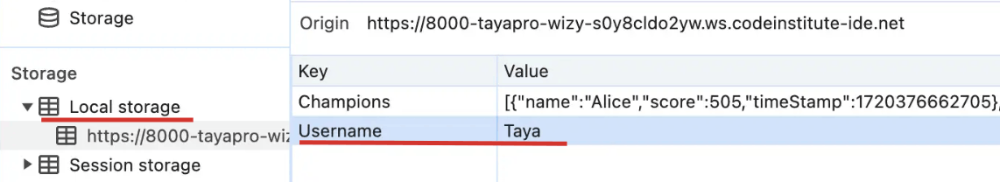
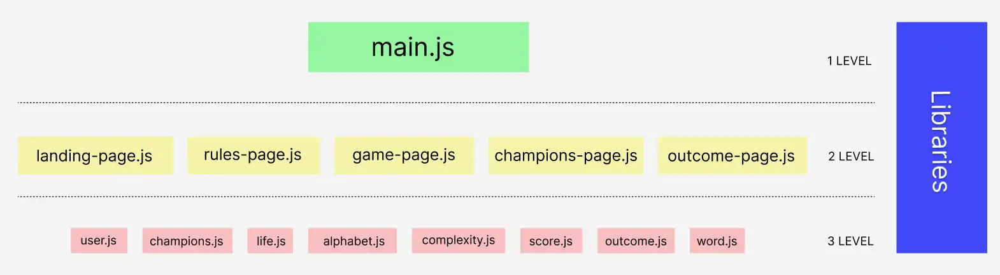
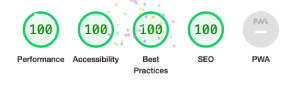

# WIZY web application

## Index – Table of Contents

- [Purpose](#purpose)
- [UX Design](#ux-design)
- [Features](#features)
- [Design](#design)
- [Project Structure (JS)](#project-structure-js)
- [Technologies](#technologies)
- [Testing](#testing)
- [Deployment](#deployment)
- [Credits](#credits)
- [Acknowledgments](#acknowledgments)

# Purpose

Who wouldn't want to be on a sandy beach by the ocean when it's raining in Ireland in the middle of July?

The WIZY hangman web application is a classic word-guessing game with a sunny vacation theme. Guess a word, save as many lives as possible, and discover your destination. It could be a stroll in the nearest park, a quick weekend trip to see your grandma, or a long vacation on a beach by the ocean.

In this game, lives are represented by travel essentials such as sunglasses, a suitcase, a hat, a camera, etc. The words to guess are based on common themes and vary in difficulty levels.

The goals are to create a challenging and enjoyable experience with different difficulty levels, easy-to-use controls, and attractive animations. The main objective is to make learning new words fun and entertaining.

The WIZY web app is built using HTML, CSS and Javascript as a Portfolio Project#2 for the Code Institute's Full Stack Developer(e-Commerce) course.

[The live WIZY web application](https://tayapro.github.io/wizy/)

---

# UX Design

## User stories

### As a **user**

- I want to easily understand the primary objective of the website.
- I want to see something personal, like my name or initials.
- I want to view a tutorial or instructions, so that I understand how to play the game.
- I want to select the difficulty level of the game, so that I can choose how challenging the game will be.
- I want to see animations when I guess a letter correctly or incorrectly, so that the game feels more interactive and engaging.
- I want to see a win or lose animation, images, message at the end of the game, so that I know the outcome.
- I want to view a leaderboard of top scores, so that I can compare my performance with others.
- I want to easily navigate the website.
- I want to make sure I don't get lost on this website.

# Features

## Existing Features

### F01 Navigation Bar

Each page has a sticky navigation bar at the top that is fully responsive. It includes a logo linking to the Home page, as well as links to the Home, Champions pages. The navigation bar layout is consistent across all devices, making navigation simple and intuitive. The underline appears when you move the mouse over the menu links.

For mobile devices, it transforms into a compact "hamburger menu." This dropdown menu contains the same items, displayed in a column on a semitransparent background.

### F02 Home page - image and call to action

When you visit the WIZY website, you're greeted by a cheerful cartoon pineapple floating on an inflatable ring in a pool or the sea. His big sunglasses and laid-back pose show he's really having a great time on his vacation. This instantly sets a positive tone.

The playful pineapple, catchy tagline, and game invitation convey the website's overall fun and engaging theme.

  
   

A fun and inviting call to action with an input field for user's name and a "Play" button makes starting the WIZY game exciting and easy.

### F03 Home page - input form

A friendly input field with the placeholder "Enter your name" and a "Play" button offers a straightforward and complete way for users to log in and start playing.

  

The LocalStorage will store a **Username** record as a key and the entered name as a value.

   

### F04 Rules page

Every game needs rules! The WIZY rules page offers them with the icons and brief instructions. Here, users can choose a game level, from easy ("Picnic in the Park") to hard ("Sunny Beach").   The theme and level names match the main page, keeping the vacation vibe going.

The Rules page's design has two versions, one for mobile devices and another for laptops.

  
   

### F05 Rules page - select form

The Rules page includes a user-friendly form where players can choose the game's difficulty level from a dropdown menu.

The LocalStorage will store a **Complexity** record as a key and LEVEL number as value.

Complexity levels mapping:

| Complexity's name    | number in WIZY system |
| :------------------- | :-------------------- |
| _Picnic in the Park_ | 0                     |
| _Campfire Tales_     | 1                     |
| _Sunny Beach_        | 2                     |

### F06 Rules page - user's icon

In the top right corner of the header, users can see their name's first letter displayed as an icon (this applies to all screen sizes).

  
   

The user's name is stored in localStorage, as explained in the _F03 Home page - input form_ section above.  
This information is used by a JavaScript function to read and update the DOM element on the Rules page.

### F07 Game page

### F08 Game page - lives blocks

### F09 Game page - alphabet buttons

### F10 Outcome page

Regardless of the game's result, players always want to see their outcome. In the WIZY game, the outcome page provides a visual representation based on the stars earned:

- For one star:

  - One gold star after animation
  - The image (adapted to different screen sizes):
      

         
         
      

  - "Grab your bike and go to a park" message

- For two stars:

  - Two gold stars after animation
  - The image (adapted to different screen sizes):
      

         
         
      

  - "Pack your backpack and visit your granny" message

- For three stars:

  - Three gold stars after animation
  - The image (adapted to different screen sizes):
      

         
          
      

  - "Sounds like someone is going to Hawai" message

If luck isn't on player's side and they lose, the Outcome page offers encouraging messages alongside a humorous picture of a girl in heart-shaped glasses.

   
    

Regardless of the game's outcome, the player is encouraged to start a new game by selecting the difficulty level and keeping the same name.

If the user wants to start a new game with a different name, they should go to the main page and enter the new name.

### F11 Outcome page - aminated stars

### F12 Outcome page - select form

### F13 Champions page

### F14 Champions page - initial champion's list

### F15 Champions page - current champions list

### F16 page 404

The design of 404 page is simple and cute.
"LOOKS LIKE YOU ARE LOST Go back to WIZY"

The linkable word "WIZY" in a gradient color helps users find their way back to the WIZY app home page.
Hover the "WIZY" link has a hover effect, it slightly grows (5%).

### F17 page 500

"OOPS! SOMETHING WENT WRONG... Start from WIZY"

The linkable word "WIZY" in a gradient color helps users find their way back to the WIZY app home page.
Hover the "WIZY" link has a hover effect, it slightly grows (5%).

## Future features

> - Create a personal account to track user's progress.
> - Option to pause the game.
> - Get hints or clues, when a user is stuck.
> - Allow a user to log out by clicking the icon with the first letter of your username in the header and confirming.
> - Add the weight of the complexity level to the score calculation.

# Design

## Imagery

## Colour Scheme

## Typography

For this project Rubik (logo) and Varela Round (body text) are used as fonts.  
Rubik font is great for a game app logo because its bold, modern design makes it stand out. 
Varela Round, with its friendly and rounded design, offers excellent readability and a warm,
approachable feel, making it a great choice for game apps.

## Wireframes

### Main Page Wireframes

### Rules Wireframes

### Game Wireframes

### Outcome Wireframes

### 404 page Wireframes

### 500 page Wireframes

# Project Structure (JS)

## Architecture

<table>
<tr>
   <td></td>
   <td>Having a good architecture for a JavaScript project is crucial for several reasons:
      <ol>
         <li><strong>Maintainability</strong>: A well-structured project makes it easier to understand, 
            modify, and extend the codebase, reducing the risk of introducing bugs when making changes.</li>
         <li><strong>Scalability</strong>: good architecture allows the project to scale and add 
            new features without becoming unwieldy or difficult to manage.</li>
         <li><strong>Collaboration</strong>: clear separation of concerns and organized code facilitates 
            teamwork, enabling multiple developers to work on different project parts simultaneously 
            without conflicts.</li>
      </ol>
   </td>
</tr>
</table>

### Project Architecture Overview

The WIZY project architecture is organized into three levels:

1. **Main Level**: This level consists of the main.js file, which serves as a router to dynamically load the content of all other pages.

2. **Pages Level**: This level comprises JavaScript files for individual pages, such as the landing page, rules page, and game page. Each file contains the specific content and functionality for its corresponding page.
   There are no horizontal dependencies at this levels. The pages js files depend only on components js files.

3. **Components Level**: This level consists of component JavaScript files. These components act as building blocks that are utilized by the page-level JavaScript files to construct the overall page logic and functionality.
   There are no horizontal dependencies at this level. The component js files depend only on library `animate.js` file.

4. **Libraries**: This section contains project-wide libraries used as external dependencies, with the potential to be released as npm packages. It currently includes an animation library that provides animation capabilities for HTML elements.

## JavaScript Structure

1. On the **Main Level**, there is a `main.js` file that imports all the pages JavaScript files such as:

   - `champions-page.js`
   - `game-page.js`
   - `landing-page.js`
   - `outcome-page.js`
   - `rules-page.js`

   Inside the `main.js` file, there is an handler function attached to the `DOMContentLoaded` event listener, which includes a `try...catch` statement to handle any internal errors.

   In case of an error, the user will be redirected to the `500.html` page.

> [!NOTE]
> Use `if...else if` instead of `switch...case` to avoid creating additional functions for parsing URLs.

2. **Pages Level**

   2.1. `champions-page.js` file is responsible for Champions page view with actual list of game leaders.
   Sets the default list of champions if no champion data exists in local storage.

3. **Component Level**

**Library** `animate.js` file

> [!NOTE]
> The files have quite detailed comments for more in-depth information.

## Main JS features

- _Dispatcher event handler function_, where using the corresponding onloading page js functions redirect to to the required HTML page based on the URL.
- The WIZY application utilizes `throw new Error` statement for error handling to gracefully manage unexpected conditions and provide informative feedback, contributing to a more reliable and user-friendly experience.
- WIZY app is a project without server-side storage and _use localStorage to store pairs: key and value_.
  LocalStorage enables data to persist across page reloads and sessions. It offers a simple and efficient method for storing user preferences, game scores, or settings directly in the user's browser.

  - **Username** localStorage record has `{Username: NAME}` format, where `NAME` is a string with 2 to 10 characters.
    The username will be changed to a new one every time, then they fill the username and click `Play` button
    on the landing WIZY page.

  - **Complexity** localStorage record has `{Complexity: NUMBER}` format, where `NUMBER` is a integer between 0 and 2.
    0 is easy level, 1 is middle complexity level, 2 is hard level.
    The selected complexity level on `Rules` page is saved on localStorage and displayed on the game's outcome page as current level for new game.  
    If the user wants to play a new game at the same level, they can do so, just click `Play` button.
    Alternatively, users can change the complexity and click the `Play` button to start a new game at the
    chosen level of complexity on the game's outcome page.

  - **Champions** localStorage record has `Champions` as key and array of 5 objects with following structure:
    `{name: USERNAME, score: SCORE_NUMBER, timeStamp: TIMESTAMP_NUMBER}` as value, where `USERNAME` is string, `SCORE_NUMBER` is total score number less 1000, `TIMESTAMP_NUMBER` - Unix epoch time.  
    The initial champions list is read and downloaded from the `champions` array in `champions.js` file. If a user achieves a score better than the minimum score in this list, they will be added to the champions list. The list will be updated
    (contains the 5 best players). A user can have a few records in the list of champions.  
    If a user refreshes the outcome page of the game multiple times, the champions page will not display any duplicates (the localStorage will also not contain duplicates).

> [!NOTE]
> There is no need to clean up localStorage before writing data because it will overwrite the `Username` and `Complexity` records. The `Champions` record will be updated based on a user's scores.

# Technologies

## Languages

- HTML5
- CSS
- Javascript

## Frameworks, Libraries & Apps

| Name                                                      | Purpose                                                 |
| :-------------------------------------------------------- | :------------------------------------------------------ |
| Google Fonts                                              | Fonts                                                   |
| Font Awesome                                              | Icons                                                   |
| Favicon.cc                                                | Create website favicon                                  |
| [Photopea](https://www.photopea.com/)                     | Work with images (resize, convert, etc)                 |
| [GoDaddy](https://www.godaddy.com/)                       | Generate HEPY logo                                      |
| [Pixelcut](https://create.pixelcut.ai/background-remover) | Remove image's background                               |
| [Vmake.ai](https://vmake.ai/image-outpainting)            | Expand the image                                        |
| [Imagecolorpicker](https://imagecolorpicker.com)          | Color picker                                            |
| [Ezgif](https://ezgif.com/)                               | Video editor                                            |
| Balsamiq                                                  | Build interface website wireframes                      |
| Git                                                       | Use for version control                                 |
| GitHub                                                    | Store the source code and deploy and host the live site |
| GitPod                                                    | Set up and run project code                             |
| Google Chrome's Dev Tools                                 | Inspect elements, layouts, debug pages                  |
| Google Chrome's Lighthouse                                | Check the performance, quality, and correctness of site |
| Google Chrome's Screen Reader                             | Test screen-reader accessibility                        |
| W3C HTML Markup Validator                                 | Validate HTML code                                      |
| W3C Jigsaw CSS Validator                                  | Validate CSS code                                       |
| JSHINT                                                    | Validate JS code                                        |

# Testing

## Features testing

[Test results]() as Google sheets.

Responsive layout has been check for all screen sizes, and focused on most popular, based on [screen-resolution-stats](https://gs.statcounter.com/screen-resolution-stats/all/worldwide/2023).

## User stories testing

This section shows connection between [Features](#features) and [UX design](#ux-design) sections.

### As a first time user

### As a returning/frequent user

- I want to easily navigate the website.

  > The user can locate the necessary pages by using the links in the navigation bar. \
  > For more details, see [F01 Navigation bar](#f01-navigation-bar)

- I want to feel welcomed on WIZY website.

- I want to make sure I don't get lost on this website.

  > In case of the user find themself on 404 page, they easily to find a link to HEPY home page. \
  > For more details, see [#F09 page 404](#f09-page-404).

## Validator testing

### HTML Validator

The W3C Markup Validation Service was employed to check the HTML of the website.  
All pages passed without any errors or warnings.

Home

Rules

Game

Outcome

Champions

404 page

### CSS Validator

The W3C Jigsaw CSS Validation Service was employed to check the HTML of the website.  
The CSS page passed without any errors or warnings.

CSS

### JS Validator

The JSHint Validation Service was employed to check the JS files.  
The JS files passed without any errors.

js/components/alphabet.js

js/components/champions.js

js/components/complexity.js

js/components/life.js

js/components/outcome.js

js/components/score.js

js/components/user.js

js/components/word.js

js/lib/animate.js

js/pages/champions-page.js

js/pages/game-page.js

js/pages/landing-page.js

js/pages/outcome-page.js

js/pages/rules-page.js

js/main.js

## Performance

Google Lighthouse in Google Chrome Developer Tools was used to check the website performance.

### Home

Home desktop

Home mobile

### Rules

Rules desktop

Rules mobile

### Game

Game desktop

Game mobile

### Outcome

Outcome desktop

Outcome mobile

### Champions

Champions desktop

Champions mobile

### 404 page

404 page desktop

404 page mobile

### 500 page

500 page desktop

500 page mobile

## Device/Browser Compatibility

Testing has been carried out on the following devices:

1. Macbook Sanoma Version 14.4.1:

   - Chrome Version 124.0.6367.61 (Official Build) (arm64)
   - Firefox Version 126.0.1 (64-bit)
   - Safari

2. Samsung S20:

   - Chrome Version 125.0.6422.165
   - Samsung Internet Version 25.0.1.3

3. iPad Air 5th generation:

   - Safari
   - Chrome

4. Windows PC:
   - Chrome Version 124.0.6367.61 (Official Build) (arm64)

# Deployment

## How to fork and deploy

1. Fork GitHub [WIZY repository](https://github.com/tayapro/wizy).
2. In the GitHub repository, navigate to the **Settings** tab and select **Pages** from the left-hand menu.
3. In the source section drop-down menu, choose the **Main Branch** and click button **Save**.
4. Once the **Save** is clicked, the page will automatically refresh and display a detailed ribbon to indicate successful deployment.
5. Any changes pushed to the main branch will be reflected in the live project.

## How to clone

1. Visit the [WIZY repository](https://github.com/tayapro/wizy) on GitHub.
2. Click the **Code** button on the right side of the screen, select **HTTPs**, and copy the provided link.
3. Open a terminal and navigate to the directory where you want to clone the repository.
4. On the command line, type `git clone`, paste the copied URL, and press the **Enter** key to begin the process.

# Credits

## Content

- The hamburger menu for mobile devices and footer icons as ideas were taken from "Love running" lesson.
- All other content was written by the developer.

## Media

## Code

## Media

- The fonts used were imported from [Google Fonts](https://fonts.google.com/)
- The icons in the header, footer were taken from [Font Awesome](https://fontawesome.com/icons)

# Acknowledgments

I want to give a big thanks to my mentor, Ronan McClelland. He gave me awesome advice on how to plan and do this project.  
Plus, he showed me useful stuff for coding and testing.  
Thanks to the Slack Community for always being there to answer my questions, sometimes even before I asked them!
